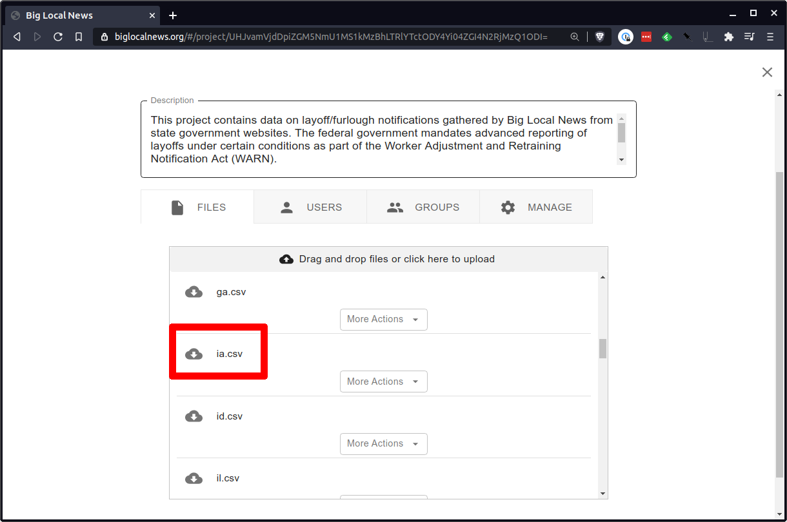
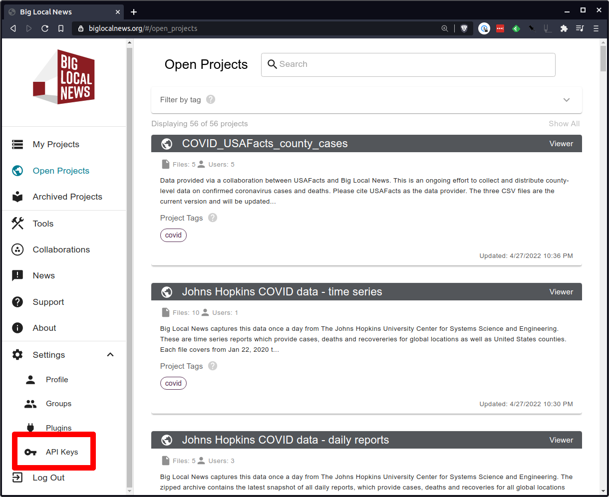

# pandas extensions

The `bln` package includes extensions for reading and writing to biglocalnews.org with the [pandas](https://pandas.pydata.org/) data analysis library.

They can be easily imported into your environment. First import pandas as usual.

```python
from pandas import pd
```

Then import the Big Local News package and connect it with your `pd` module.

```python
import bln

bln.pandas.register(pd)
```

Your standard `pd` object now contains a set of custom methods for interacting with biglocalnews.org. This is accomplished by [“monkey patching”](https://en.wikipedia.org/wiki/Monkey_patch) the pandas library.

## Reading data

You can read in files from biglocalnews.org as a pandas [dataframe](https://pandas.pydata.org/pandas-docs/stable/reference/api/pandas.DataFrame.html) using the `read_bln` function. It requires three inputs:

1. The unique identifier of the biglocalnews.org project where the file is stored
2. The name of the file within the biglocalnews.org project
3. An API key from biglocalnews.org with permission to read from the project.

```python
df = pd.read_bln(your_project_id, your_file_name, your_api_token)
```

You can find the project id by visiting the project on biglocalnews.org and pulling the long hash from the URL. Here's the [WARN Act Notices](https://biglocalnews.org/#/project/UHJvamVjdDpiZGM5NmU1MS1kMzBhLTRlYTctODY4Yi04ZGI4N2RjMzQ1ODI=) open project.


The name of the file can be found in the Files panel. Here's the Iowa data stored in `ia.csv`.



You can get an API key by visiting the link in the Settings menu.



If the token is set to the `BLN_API_TOKEN` environment variable, it doesn't have to be passed into the `read_bln` function.

Combine the entire example together and you can access the Iowa data file from the WARN Act Notices project with the following:

```python
import pandas as pd
import bln

bln.pandas.register(pd)

project_id = "UHJvamVjdDpiZGM5NmU1MS1kMzBhLTRlYTctODY4Yi04ZGI4N2RjMzQ1ODI="
file_name = "ia.csv"
df = pd.read_bln(project_id, file_name)
```

Now you've got a dataframe to work with.

```python
df.head()
```

```
                                   Company          Address Line 1             City  ...
0                        SSP America, Inc.        5800 Fleur Drive       Des Moines  ...
1              Premier Linen & Drycleaning     461 West 9th Street          Dubuque  ...
2                        Caterpillar, Inc.      1003 Miller Street          Elkader  ...
3  General Dynamics Information Technology  2400 Oakdale Boulevard       Coralville  ...
4                            Alorica, Inc.    2829 Westown Parkway  West Des Moines  ...
```

The `read_bln` function will also accept any of the standard configuration options offered by pandas reader functions, like [`read_csv`](https://pandas.pydata.org/pandas-docs/stable/reference/api/pandas.read_csv.html). Here's an example using the `parse_dates` input.

```python
df = pd.read_bln(project_id, file_name, parse_dates=["Notice Date"])
```

## Writing data

You can write a file to biglocalnews.org using our custom `to_bln` dataframe accessor. Like the `read_bln` method, it requires three input:

1. The unique identifier of the biglocalnews.org project where the file will be stored
2. The name of the file to create within the biglocalnews.org project
3. An API key from biglocalnews.org with permission to read from the project.

```python
df.to_bln(your_project_id, your_file_name, your_api_token)
```

You can find the project id by visiting the project on biglocalnews.org and pulling the long hash from the URL. Here's the [WARN Act Notices](https://biglocalnews.org/#/project/UHJvamVjdDpiZGM5NmU1MS1kMzBhLTRlYTctODY4Yi04ZGI4N2RjMzQ1ODI=) open project.


You can name the file whatever you like. The filenames must end with .csv, .json, .xls, or .xlsx. The extensions are mapped to the appropriate pandas writer function.

You can get an API key by visiting the link in the Settings menu.


If the token is set to the `BLN_API_TOKEN` environment variable, it doesn't have to be passed into the `read_bln` function.

Combine the entire example together and you can upload a data file from your computer to WARN Act Notices project with the following:

```python
import pandas as pd
import bln

bln.pandas.register(pd)

df = pd.read_csv("my-local-file.csv")

project_id = "UHJvamVjdDpiZGM5NmU1MS1kMzBhLTRlYTctODY4Yi04ZGI4N2RjMzQ1ODI="
file_name = "my-uploaded-file.csv"
df.to_bln(project_id, file_name)
```

The `to_bln` method will also accept any of the standard configuration options offered by pandas writer functions, like [`to_csv`](https://pandas.pydata.org/pandas-docs/stable/reference/api/pandas.DataFrame.to_csv.html). Here's an example using the `index` input.

```python
df.to_bln(project_id, file_name, index=False)
```
